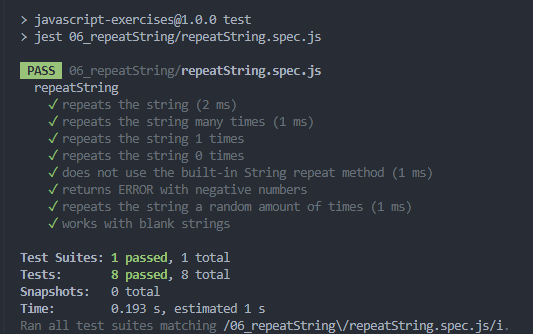
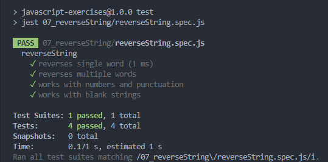
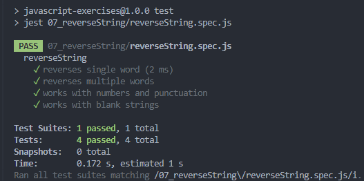
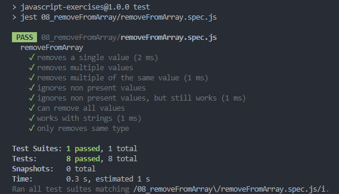
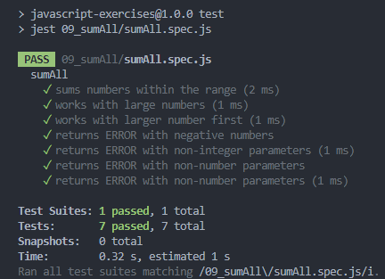
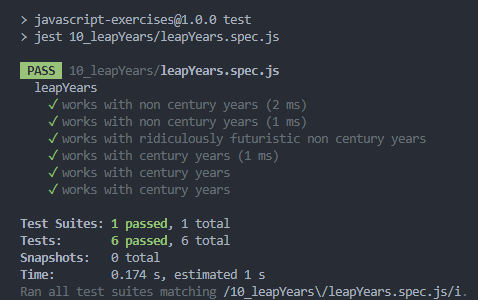
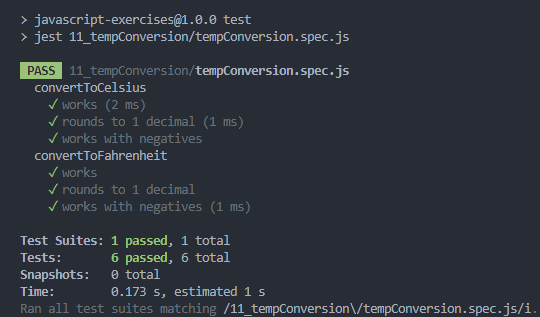

# Loops And Arrays

Learning about: loops, control structures that allow repeated execution of a code block; and, arrays, data structures
that can store multiple values in a single variable.

- Completed as part of the **JavaScript Basics** section of the **Foundation Course** at [TheOdinProject](https://www.theodinproject.com).
- Taken from  the specified **javascript-exercises** repo, [specifically](https://github.com/TheOdinProject/javascript-exercises)

---

## Assignment Instructions

 - [06 - repeatStrings &rArr;](./js-exercises/06_repeatString/)
 - [07 - reverseString &rArr;](./js-exercises/07_reverseString/)
 - [08 - removeFromArray &rArr;](./js-exercises/08_removeFromArray/)
 - [09 - sumAll &rArr;](./js-exercises/09_sumAll/)
 - [10 - leapYears &rArr;](./js-exercises/10_leapYears/)
 - [11 - tempConversion &rArr;](./js-exercises/11_tempConversion/)

## Results

<table>
<tr>

<td>

### 06 - repeatStrings

</td>
<td>

### 07a - reverseString

Using for to loop through the string as an array.

</td>
</tr>
<tr>
<td>

### 07b - reverseString

Using built in string and array methods.

</td>
<td>

### 08 - removeFromArray

</td>
</tr>
<tr>
<td>

### 09 - sumAll

</td>
<td>

### 10 - leapYears

</td>
</tr>
<tr>
<td>

### 11 - tempConversion

</td>
</tr>
</table>

